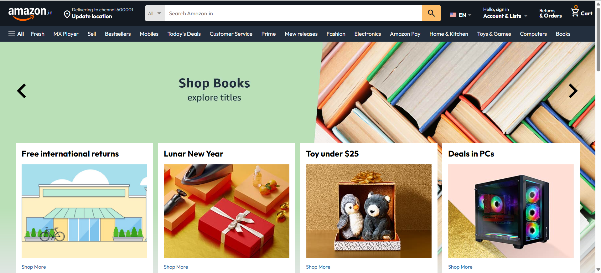
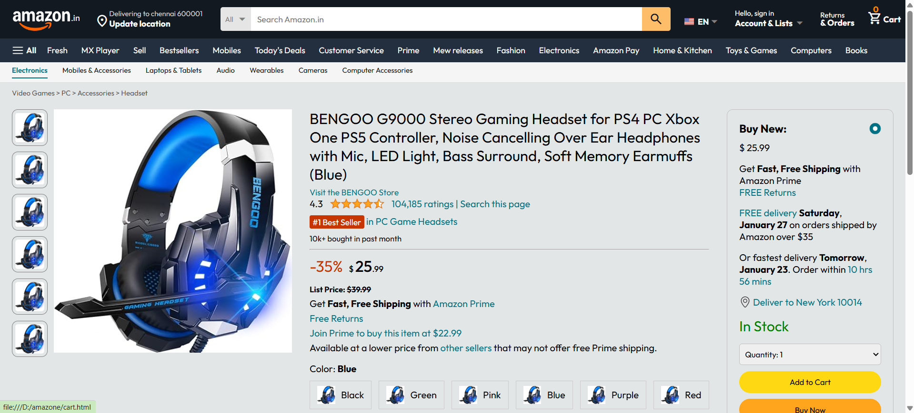
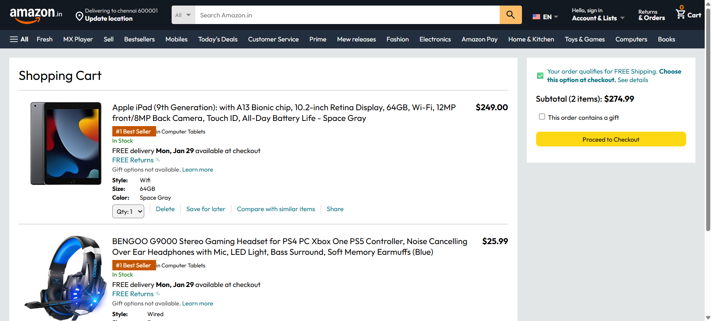
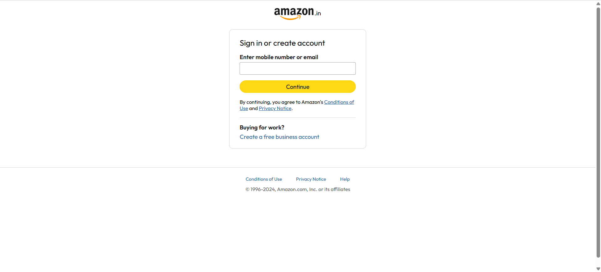

# 🛒 Amazon Clone (Frontend)

Responsive design of an Amazon website clone created in HTML, CSS, and JavaScript.

## Live Demo
https://Gowthami-bot.github.io/amazone/

## Screenshots

### Home Page

### Product Page

### Cart Page

### Login Page

## Features
- Amazon styled Navbar
- Product slider
- Product cards grid layout
- Product details page
- Login page UI
- Responsiveness

## Tech Stack
- HTML
- CSS
- JS

## Author

**Gowthami**

- GitHub: https://github.com/Gowthami-bot

- > This project is part of my journey to become a full-stack developer.
